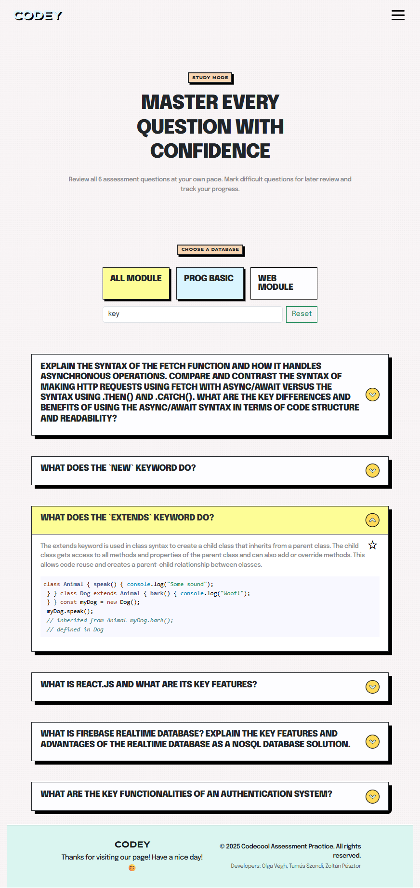

# Learning App - Codey

A modern React + Firebase learning app with authentication, protected routes, and a neobrutalism-inspired UI.

## Features

- Firebase Authentication (Sign up, Sign in, Protected pages)
- React Router v6+ (public, protected, and guest routes)
- HashLoader spinners for professional loading states
- Organized component structure (cards, forms, ui, layout, routes)
- Neobrutalism design with Bootstrap

## Preview

